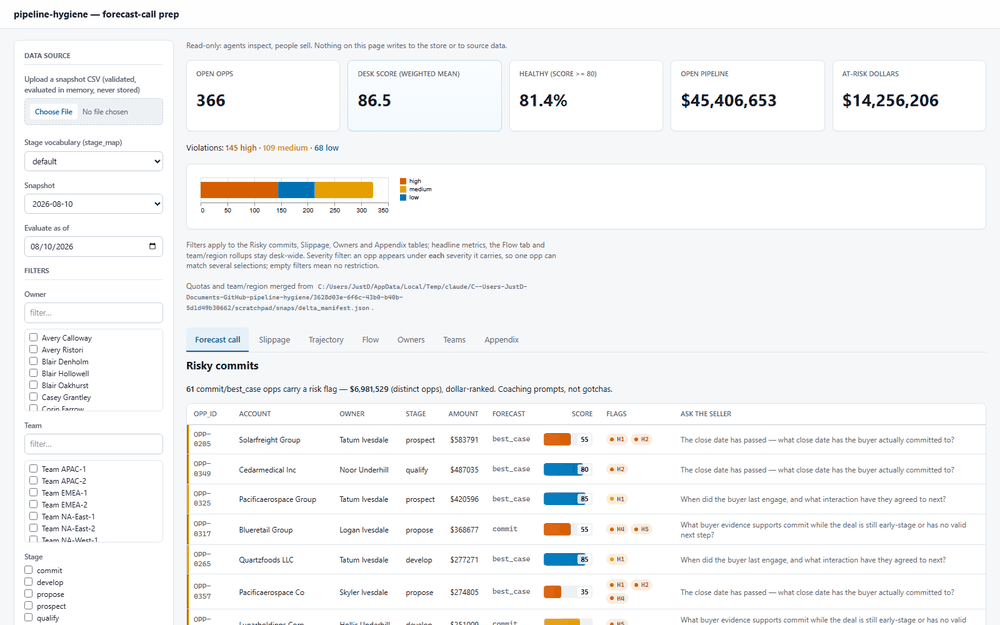
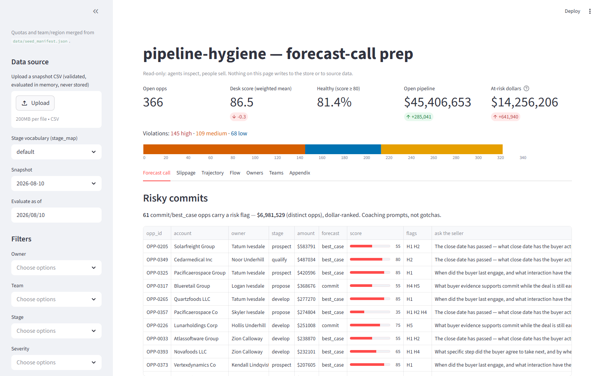
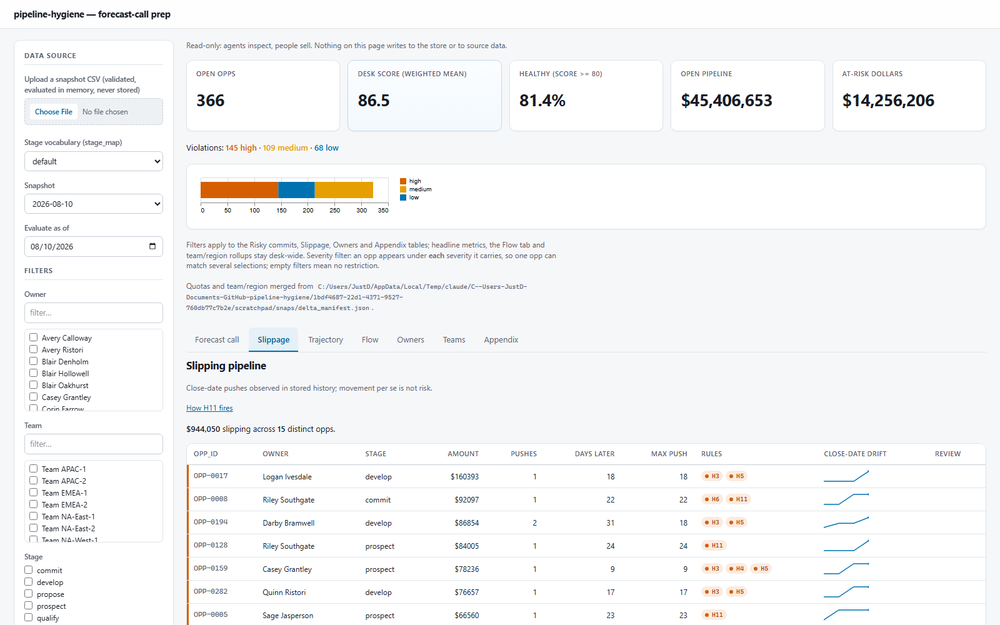
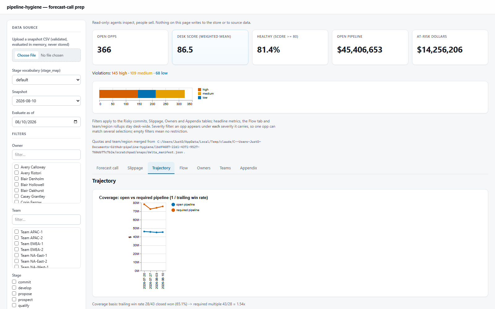
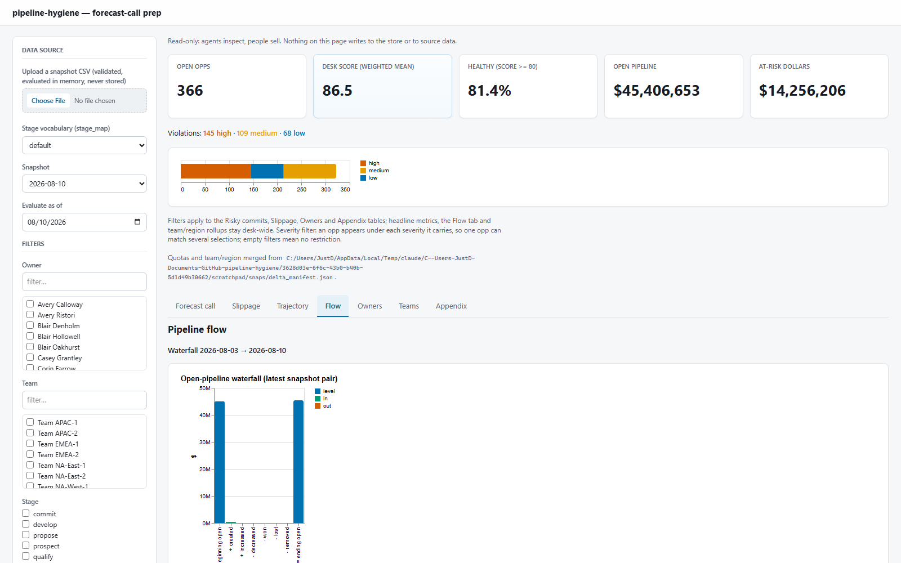
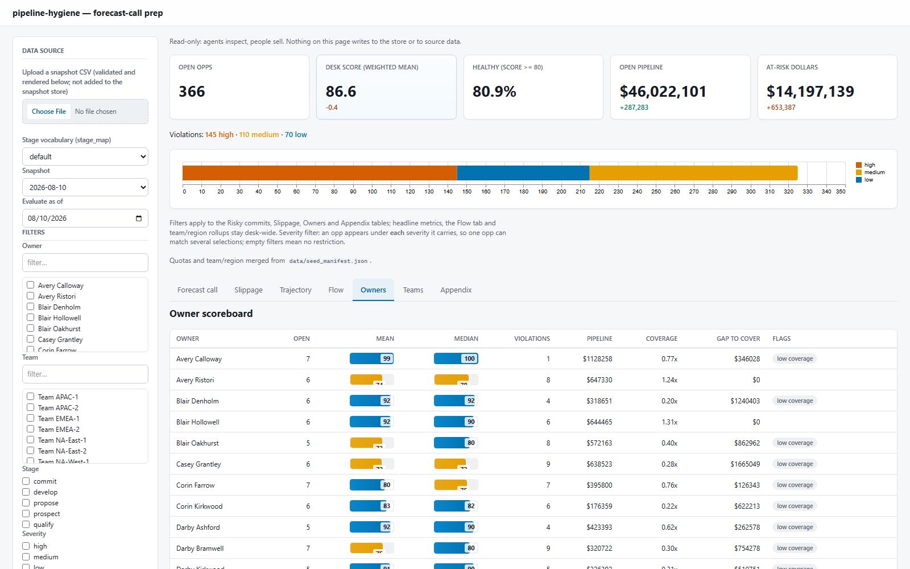
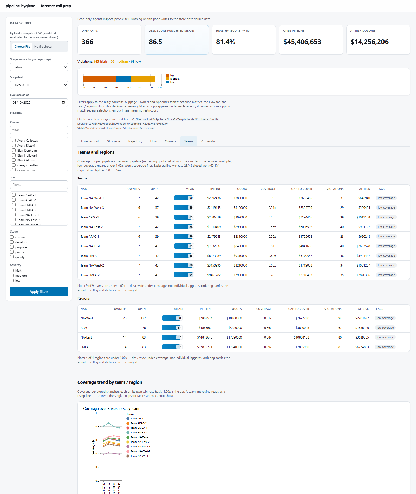
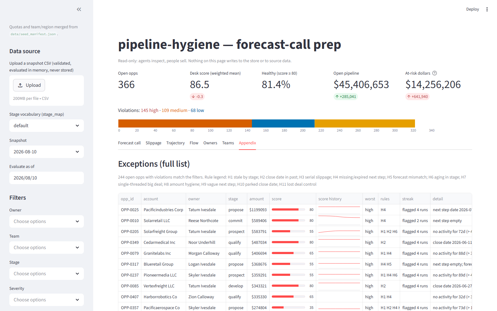

# pipeline-hygiene

A local-only sales pipeline inspection app. This tool ingests CRM opportunity
snapshots (CSV exports) into a SQLite snapshot store, runs deterministic hygiene rules
(H1-H11), and provides opportunity, owner, and desk insights.

The tool is intended to be run in a local environment (e.g. Azure server / workspace) to protect sensitive data. After install in the local environment, all data stays local.

Note: The tool in its current state is designed to demonstrate potential sales pipeline automation opportunities. See the [Target Architecture](#future-state-architecture--automation) section for details on how this tool could be architected for an enterprise environment. 

## Demo

The read-only dashboard cycling through its seven tabs. This GIF is generated
from the stills in `docs/screenshots/` by `scripts/build_demo_reel.py`, so it
stays in sync with them (CI rebuilds it whenever the screenshots change).



## Security & secure-by-design

This tool handles sales-pipeline data, so it keeps that data local, inert, and hard to exfiltrate by design:

- **Read-only against source.** It never writes back to a CRM, contacts sellers, or mutates source files or the snapshot store — viewing, filtering, and downloading a brief record nothing. The one writable surface is the optional local packet ledger (`work_items` / `work_item_events`, behind `PIPELINE_HYGIENE_PACKETS`): draft work items you accept/edit/dismiss, never source data, and every decision is timestamped in an append-only audit trail.
- **Local-only by default.** `python -m app.server` binds `127.0.0.1`; serving to a non-local host requires an explicit `PIPELINE_HYGIENE_ALLOW_NONLOCAL_HOST=1` opt-in.
- **No LLM, API, or network egress.** Nothing in the tool calls out. The optional notes-capture flow is *manual entry* — a human types the note; there is no model or hosted extractor. Notes are stored locally, credential-scrubbed before storage, and each proposed field update must quote the note verbatim (validated in code) before a human ever sees it.
- **Offline, locked-down front-end.** All assets (htmx, vega, Tailwind) are vendored under `app/static` and integrity-pinned — no CDNs or third-party calls — under a strict `default-src 'self'` CSP (with `form-action`/`connect-src 'self'`) and no `unsafe-eval`.
- **Uploads never persist.** An uploaded CSV is validated and held in a transient in-memory session, then pruned on expiry — nothing is written to disk or the store.
- **Auth at the platform edge.** The app ships no bespoke auth; the packet write routes are single-operator by design, same-origin guarded, and localhost-bound by default. If you deliberately opt into a non-local bind for real data, put sign-in in front of it (e.g. Azure "Easy Auth" / Entra), so there's no auth code to get wrong.

This is a demo-grade tool, not a hardened multi-tenant service (no built-in RBAC or multi-user access control — though the optional packet ledger keeps an append-only decision log): the default posture is safe (local, read-only against source, offline), and using it with real data is a deliberate, gated step.

## Bring your own CSV

Export data from your CRM and upload the file to the dashboard. The tool does the rest.

If you want to generate test / seed data, use the following commands.

```
python -m src.ingest your_export.csv --stage-map your_map
python -m src.brief --as-of 2026-08-10 --quotas your_quotas.json --digests
```

## Features
## Dashboard (FastHTML)

```
python -m app.server        # then open http://127.0.0.1:5100
```

The dashboard is a read-only page: it never changes your data, and viewing or
downloading a brief records nothing. It runs locally on `127.0.0.1` by default
and works fully offline — no CDNs, external calls, or fonts pulled from the
internet — in a light Microsoft-style theme.

Every tab shares the same header: desk score, open pipeline, and at-risk dollars
with week-over-week arrows (at-risk turns red as it rises), the violation counts,
and a severity-mix bar. The sidebar chooses the data source (a stored snapshot or
a CSV upload), sets the `as_of` evaluation date, and filters by owner, team,
stage, or severity — the headline metrics and team/region rollups always stay
desk-wide.

### Forecast call (landing tab)

Built to stand alone for a Monday meeting: the risky commits table — every
open commit/best_case deal carrying a risk flag, dollar-ranked, each with
the deterministic coaching prompt of its dominant rule — plus the
since-last-run summary line. Sidebar filters apply here too, so a
frontline manager can run her 9:00 call on just her team's risky commits.



### Slippage

Push analytics from snapshot history: how often each deal's close date has
slipped and by how much, the H11 badges, a disqualification-review marker at
3+ pushes, and a small close-date drift sparkline per deal.



### Trajectory

Charts across stored snapshots: coverage (open vs required pipeline, with its
basis printed underneath) and the desk-score trend. Needs at least 2 snapshots;
with fewer it shows a short caption instead of a misleading one-point trend.
Below the charts, commit accuracy by the quarter each deal was first called
commit — so a later slip stays counted against the quarter it was promised for.



### Flow

Where the pipeline dollars went between the last two snapshots, and whether
enough new pipeline is being created. An open-pipeline waterfall (beginning +
created + increased − decreased − won − lost − removed = ending) that reconciles
exactly, pipeline-generation pacing per week against an optional target line, and
created-vs-closed bars per week. The same waterfall appears as a table on brief
page 1.



### Owners

Owner scoreboard (scores, pipeline dollars, coverage, small-n and low-coverage
flags), the forecast-integrity patterns (over- and under-calling), and the
per-owner commit-accuracy ledger — all marked "coaching signal, not a comp
input." Coverage uses the same basis as the desk headline, and `low_coverage`
means exactly under 1.00x, so the ratio and the flag can never disagree.



### Teams

Team and region roll-ups over the same open opps — owners, pipeline, quota,
coverage, violations, at-risk dollars — sorted worst-coverage first, so the order
itself carries the signal. When most groups trip the flag, each table notes it as
a desk-wide condition rather than "every team failing." Below the tables, a
per-team and per-region **coverage trend** across snapshots, plus commit accuracy
by team and region. Team/region membership comes from the quotas JSON; without
it, the tab shows a caption instead.



### Appendix

The full exception list — the only place it appears; drill-down, never the
headline — with streak annotations ("flagged N runs") and per-opp score
history sparklines, plus the validation report and the download-brief
button.



## Install & run

Two ways: local Python, or Docker (no Python needed).

### Option A — Docker (no local Python)

You still need the repo (Docker builds the image *from* it — the app code and demo data are copied in), but you don't install Python or any dependencies on your host:

```
bash
git clone https://github.com/Doogit/pipeline-hygiene.git
cd pipeline-hygiene

docker build -t pipeline-hygiene .
docker run -p 8000:8000 pipeline-hygiene   # open http://127.0.0.1:8000
```

### Option B — Local (Python 3.10+)

```
bash
git clone https://github.com/Doogit/pipeline-hygiene.git
cd pipeline-hygiene

# optional but recommended: isolate deps
python -m venv .venv && source .venv/bin/activate   # Windows: .venv\Scripts\activate

pip install -r requirements.txt
```

That installs the runtime (pyyaml, pandas, python-fasthtml, altair). No services, no API keys, no LLM calls, and no Node/CSS build step — the Tailwind stylesheet ships prebuilt in `app/static`.

The dashboard reads from a local SQLite store that isn't committed, so load the bundled demo snapshots once before launching:

```bash
# bash / macOS / Linux
for f in data/snapshots/opps_*.csv; do python -m src.ingest "$f"; done
```

```powershell
# Windows PowerShell
Get-ChildItem data/snapshots/opps_*.csv | ForEach-Object { python -m src.ingest $_.FullName }
```

Then run it:

```bash
python -m app.server        # open http://127.0.0.1:5100
```

Ingesting the full four-snapshot series (not just one) is what makes the Trajectory, Slippage, and Flow tabs populate. To use real data instead, ingest your own CRM export — see [Bring your own CSV](#bring-your-own-csv).

## Hygiene rules (H1–H11)

Each rule is a deterministic pure function `(row, config, as_of)` with a
versioned threshold in `config.yaml` (the same legend prints at the foot of
every brief). Score starts at 100 and each violation deducts its weight.

| Rule | Meaning | Key threshold(s) in `config.yaml` | Weight |
|---|---|---|---|
| H1 | stale by stage | `staleness_days` (per stage) | 15 |
| H2 | close date in past | close_date < as_of | 20 |
| H3 | serial slippage | ≥2 close-date changes (high at 3) | 10 |
| H4 | missing/expired next step | next_step empty or next_step_date < as_of | 20 |
| H5 | forecast mismatch | commit on pre-develop stage, or no valid next step | 25 |
| H6 | aging in stage | `aging_norm_days` (per stage) | 10 |
| H7 | single-threaded big deal | `big_deal_threshold` and contact_count < 2 | 10 |
| H8 | amount hygiene | amount blank or ≤ 0 | 5 |
| H9 | vague next step | `next_step_quality` (min chars / filler / action verb) | 5 |
| H10 | parked close date | `close_date_horizon_days` | 10 |
| H11 | lost deal control | `push_alarm_days` / `cumulative_push_alarm_days` | 20 |

H3, H6, and H11 need snapshot history; with a single snapshot H3/H6 report
`insufficient_history` (never a false flag) and H11 is silent.

## Implementation notes:

- Data source: the latest stored snapshot from `data/pipeline.db` by
  default (snapshot selectable in the sidebar). An uploaded CSV runs the
  same ingest validation in memory, renders as a full single-snapshot page,
  and is kept only in a short-lived in-process session so drill-down and
  Markdown download target the uploaded rows without writing to the snapshot
  store. Sidebar
  owner/stage/severity filters apply to the Slippage, Owners, and Appendix
  tables.
- Tables render from the view model: a CSS bar for 0-100 scores, `$%d`-style
  formatting for amounts, inline SVG sparklines for close-date drift and
  score history, plain text badges for rules (Okabe-Ito colorblind-safe
  severity palette; colored text, no emoji).
- Charts emit Altair-built Vega-Lite specs, rendered client-side by the
  vendored vega/vega-lite/vega-embed served locally (no CDN); the Flow
  "created vs closed" hover is preserved.
- Runtime paths can be overridden with `PIPELINE_HYGIENE_CONFIG`,
  `PIPELINE_HYGIENE_DB`, and `PIPELINE_HYGIENE_QUOTAS` (used by the
  view-model, server, and parity suites under `tests/` to run against
  isolated fixtures).
- Source screenshots live in `docs/screenshots/` (captured from the app
  running headless on 127.0.0.1 against the committed series data); the
  README demo reel is rebuilt from them by `scripts/build_demo_reel.py`.

## Layout

```
src/            ingest.py, snapshots.py, rules.py, scoring.py, brief.py
src/seed/       org simulator: __main__.py, org.py, pathologies.py, series.py
app/            server.py + render.py (read-only FastHTML dashboard), static/ (vendored htmx/vega/Tailwind)
data/           generated CSVs, seed_manifest.json, delta_manifest.json, pipeline.db
tests/          pytest + hypothesis; loads tests/config_test.yaml ONLY
out/            generated desk briefs (Task 5)
config.yaml     runtime thresholds, stage_map, rule weights
```

## Usage

```
python -m src.seed --rows 400 --as-of 2026-08-10        # single snapshot + ground-truth manifest
python -m src.seed --series 4 --as-of 2026-08-10        # weekly snapshots T0..T3 + delta manifest
                                                        # add --progress-per-week N to advance N clean
                                                        # opps one stage forward each week (mid-funnel
                                                        # movement; the shipped demo data uses 8)
python -m src.ingest --init your_export.csv             # "doctor": inspect a CSV, print a stage_map
                                                        # skeleton (FIXME per unmatched stage); exits
                                                        # nonzero only on missing required columns
python -m src.ingest data/opps_2026-08-10.csv           # validate + load into data/pipeline.db
python -m src.brief --as-of 2026-08-10 --quotas data/seed_manifest.json
                                                        # write out/desk_brief_2026-08-10.md
                                                        # (series mode writes data/delta_manifest.json
                                                        # instead — it carries the same quotas/owners
                                                        # blocks; pass whichever file your seed run wrote)
python -m src.brief --as-of 2026-08-10 --quotas data/seed_manifest.json --digests
                                                        # ...plus out/digests/<as_of>/<owner>.md
python -m src.brief --as-of 2026-08-10 --quotas data/seed_manifest.json --team "Team EMEA-1"
                                                        # filtered brief for one team (repeatable
                                                        # --team/--owner/--region, case-insensitive;
                                                        # writes a suffixed file, never records a run)
python -m src.brief --as-of 2026-08-10 --quotas data/seed_manifest.json --commit-scrub
                                                        # ONLY the pre-forecast-call scrub sheet
                                                        # (out/commit_scrub_<as_of>.md): every open
                                                        # commit/best_case opp + checklist columns;
                                                        # no brief, never records a run; composes
                                                        # with --owner/--team/--region
python -m src.backtest --as-of 2026-08-10               # out/backtest_<as_of>.md: for each rule, how
                                                        # its flagged opps actually resolved (won/lost/
                                                        # open) from this org's own stored history
python -m src.funnel --as-of 2026-08-10                 # out/funnel_<as_of>.md: per-stage width,
                                                        # advancement (advanced/stalled/won/lost) and
                                                        # median observed dwell, from stored snapshots
python -m app.server                                    # read-only dashboard (127.0.0.1:5100)
pytest -q                                               # full test suite
```

Point `--db`, `--config`, `--quotas`, and `--out-dir` at your files, or set
`PIPELINE_HYGIENE_DB` / `PIPELINE_HYGIENE_CONFIG` / `PIPELINE_HYGIENE_QUOTAS` /
`PIPELINE_HYGIENE_OUT` (ingest, brief, and the dashboard all honor the store
and config vars; brief also honors the quotas and out-dir vars). To keep an
evaluation trial fully isolated, set `PIPELINE_HYGIENE_DB` and
`PIPELINE_HYGIENE_OUT` to a scratch location so neither the store nor the
written briefs touch your production copies. The brief prints `reading
snapshot store <path>` to stderr so a scheduled run can't silently brief the
wrong database.

## Persona pass

`.claude/skills/persona-pass` runs a usability simulation: it role-plays each
user persona in [docs/personas.md](docs/personas.md) (frontline manager,
RevOps analyst, VP, flagged AE) against the real product to surface usability
and product gaps that unit tests miss. Run it before a release or after any
change to the brief, digests, dashboard, or CLI.

## Reproducible runs (clock determinism)

Every function that evaluates time takes an explicit `as_of: date`;
`date.today()` appears only as the default for a CLI `--as-of` flag, never
inside the engine. Because nothing reads the wall clock mid-computation, a run
is fully reproducible: the same snapshots evaluated at the same `as_of` always
produce the same flags, scores, and brief. That is what makes the golden-file
test and a defensible audit trail possible.

## How correctness is verified (epistemics)

Two independent oracles keep the engine honest, so a passing suite means more
than "the code agrees with itself":

- **Per-rule unit tests** pin each rule's exact boundaries — at the threshold,
  one step past, empty/null — so no rule can silently drift.
- **The seed-manifest integration test** runs the whole engine over a generated
  org and checks its output against the manifest. The manifest's expected
  violations are built field-by-field by the generator, *never* by running the
  rules engine, so the two are checked against each other rather than against a
  shared source — the comparison is non-circular.

## Decisions

The key design decisions; finer implementation rationale lives in `SPEC.md`,
the code, and git history.

- **Read-only, coaching not comp.** The agent never writes to source data or
  contacts sellers. Owner/team scoreboards, forecast-integrity patterns, and
  the commit-accuracy ledger all carry a "coaching signal, not a comp input"
  disclaimer, sort alphabetically/chronologically (never worst-first — a
  leaderboard is one sort from a comp weapon), and suppress a percentage until
  `min_opps_for_owner_score` items have resolved (a bare "100%" on n=1 is the
  number that gets screenshotted).
- **Deterministic engine.** Every rule is a pure `(row, config, as_of)`
  function with a versioned threshold in `config.yaml`; no model, no
  randomness. `date.today()` lives only in CLI defaults (see Reproducible
  runs), and the golden brief (`tests/golden/desk_brief_golden.md`) is compared
  byte-for-byte — to regenerate, delete it and run the test once (it recreates
  the file and fails asking for review).
- **One coverage basis everywhere.** `scoring.required_coverage_multiple` is
  the single source of truth: coverage is open pipeline / (remaining quota ×
  required multiple), and `low_coverage` fires exactly when that ratio is under
  1.00x — so the shown ratio and the flag can never contradict each other. The
  basis string carries the exact fraction (`trailing win rate 20/32 closed won
  (62.5%) -> required multiple 1.60x`) so a reader can reproduce the number to
  the dollar; a rounded multiple alone broke a persona sim's napkin check by
  ~$285K.
- **Since-last-run is diff-based.** Each full brief run records its per-opp rule
  sets in the `runs` table; the next run diffs against it. Violations that
  vanish because a deal closed are reported under "Closed", never "Cleared";
  newly appearing opps are listed separately and their violations aren't counted
  as new flags. Flag streaks count consecutive *runs*, and re-running on the
  same snapshot replaces that run (idempotent) so streaks never inflate.
- **Filtered and scrub outputs never record a run.** `--owner`/`--team`/
  `--region` briefs and `--commit-scrub` write suffixed files and are never
  written to the `runs` table (a partial open-opp map would corrupt streaks and
  since-last-run for later full briefs).
- **Private digests, not published rankings.** `--digests` writes one private
  coaching digest per owner (`out/digests/<as_of>/<owner_slug>.md`) with only
  that owner's data — coaching evidence favors private weekly digests; published
  rankings raise attrition.
- **Quotas/metadata come from the `--quotas` JSON, not `config.yaml`.** Seed
  never mutates `config.yaml`; it writes quotas and owner `{team, region}`
  metadata into `data/seed_manifest.json`, which callers merge at run time.
  Coverage, teams, and regions are blank without it.
- **History-only push stats.** H11 ("lost deal control") derives `push_count`,
  `cumulative_extension_days`, and `max_push_days` from consecutive stored
  snapshots where close_date moved *later* — never from a CSV column. With
  fewer than 2 snapshots there are zero observed transitions, so H11 is simply
  silent (no `insufficient_history` state).
- **Validation is strict and persisted.** Missing required *columns* are fatal
  (nonzero exit); invalid *rows* are rejected into a ValidationReport. Mixed
  currency in one file is fatal; a uniform-but-unexpected currency is a warning.
  The per-snapshot report is stored as `validation_json` on the `snapshots`
  table so the brief and dashboard surface it without re-validating.
- **New config keys are optional and back-compatible.** Every key added after
  the frozen `tests/config_test.yaml` is schema-checked only when present with
  defaults applied at point of use (e.g. `display_currency_symbol`,
  `pipeline_gen_weekly_target`, `staleness_escalation`), so the frozen test
  config and existing deployments stay byte-identical.
- **Fiscal quarters** are labeled `FY<year>-Q<n>`, the fiscal year named for the
  calendar year it ends in (with `fiscal_year_start_month: 7`, 2026-08 is
  FY2027-Q1).

## Future State Architecture & Automation

> Status: design/roadmap. Everything below is planned evolution of the current read-only, CSV-first tool. Nothing here changes the core principle: **agents inspect and draft; people decide and sell.**

**Today vs. the enterprise future.** The shipped tool is deliberately *local-only*: no LLM, no API, no network egress, and capture is manual entry validated in code. The work queue described below is already real — `work_items` / `work_item_events` back the Packets tab and the per-owner packets. What the architecture below adds is the **in-tenant enterprise deployment**, where the tool runs governed inside an organization's own environment and the edges go native. That is the context where interconnectivity and model-assisted (LLM) extraction come into play — under agent governance, first-party connectors, and delegated permissions — not the standalone local tool.

### Design position

Pipeline-hygiene is deliberately built vendor-neutral and export-agnostic: it never assumes a source schema, never connects directly to a CRM, and never writes to a system of record. The column-mapping layer treats any pipeline export as a config problem, not a code problem. That's not a limitation — it's what lets the same tool run against any CRM export on day one, and what keeps its approval footprint at zero.

The future state keeps that core and upgrades the **edges**: how data arrives, how outputs are delivered, and how the whole thing runs governed inside an enterprise tenant.

### Target architecture

```
┌─ Ingestion edge (native, swappable) ─────────────────────────┐
│  Scheduled BI subscription ──► mailbox rule / flow ──► watched folder
│  Low-code flow (e.g. Power Automate + Dataverse connector) ──► CSV drop
│  Paste / drag-in (ad hoc)                                    │
└──────────────┬───────────────────────────────────────────────┘
               ▼
┌─ Adapter layer ──────────────────────────────────────────────┐
│  Normalizes every source into two shapes:                    │
│    records  — structured rows w/ provenance (snapshots, quotas)
│    notes    — raw text w/ metadata (meeting notes, transcripts)
│  Adapters only normalize. No business logic at the edge.     │
└──────────────┬───────────────────────────────────────────────┘
               ▼
┌─ Core (unchanged) ───────────────────────────────────────────┐
│  Canonical schema · mapping profiles · snapshot store        │
│  Deterministic rules engine (hygiene, slippage, coverage)    │
│  Work queue: every proposal is draft-only until a human accepts
└──────────────┬───────────────────────────────────────────────┘
               ▼
┌─ Delivery edge ──────────────────────────────────────────────┐
│  Dashboard (manager) · per-seller digest (email/chat, push)  │
│  All artifacts trace to source data; nothing auto-sends      │
└──────────────────────────────────────────────────────────────┘
```

### Ingestion roadmap

| Phase | Path | Mechanism |
|---|---|---|
| Today | Manual export | Upload/paste a CSV; saved mapping profile applies in seconds |
| Next | Watched folder | Cloud-synced folder polled by the tool; newest export auto-ingests |
| Next | Scheduled export | BI-layer subscription delivers the export on a cadence; a low-code mail rule lands it in the watched folder — a fully automated nightly refresh built entirely from sanctioned, existing tooling |
| Later | Native low-code pull | Where permitted, a low-code flow (e.g. Power Automate with a Dataverse connector) queries the opportunity table under the operator's own delegated permissions and drops a CSV — no new application registration, no elevated access |
| Later | Notes sources | Meeting notes and transcripts via paste/drag first; then delegated-permission reads of the operator's own notebooks and mail, normalized through the same adapter layer |

The ordering is deliberate: each phase removes friction without raising the approval threshold. Every path uses the operator's existing access through sanctioned tooling.

### Enterprise deployment (in-tenant)

When deployed inside a Microsoft-centric enterprise, the vendor-neutral core stays; the edges go native:

- **Compute & data:** containerized API + SPA on Azure Container Apps; PostgreSQL (Azure Database) replacing local storage for multi-user concurrency.
- **Identity:** Entra ID sign-in; roles (manager / seller / read-only) mapped from security groups; row-level scoping by opportunity owner.
- **Ingestion:** Power Automate flows replace file-watching — first-party connectors for the CRM/Dataverse, mail, Teams, and OneNote feed the same adapter layer.
- **Agent governance:** extraction and drafting agents are registered with their own agent identities (Entra Agent ID) and operate under an agent-governance control plane (Agent 365), so every agent action is inventoried, attributable, and auditable — the same governance posture the security stack sells to customers, applied to the tooling itself.

The work-queue design doubles as the audit trail: every agent proposal and every human accept/edit/dismiss decision is timestamped and attributed. Draft-only agents plus a decision log is the governance answer built into the architecture, not bolted on.

### What will not change

- Read-only against systems of record. The tool proposes; humans commit changes through the CRM's own interface.
- Deterministic, explainable rules for anything that scores or flags a deal. Model-assisted extraction is validated by code and evidenced by verbatim quotes before a human ever sees it.
- One surface per persona. Sellers receive a digest where they already work; managers get the dashboard. New capability must reduce surfaces, not add them.

## Handoff

Recently implemented (now shipping):

- Seed series stage progression: `--progress-per-week` creates mid-funnel
  movement for conversion and dwell analytics.
- Org-specific backtesting: `python -m src.backtest` reports each rule's
  flagged opportunities joined to final observed outcomes from stored history.
- Stage-funnel analytics from stored snapshots: `python -m src.funnel`
  reports width, advancement, closed outcomes, and observed median dwell by
  open stage without reading the seed delta manifest.
- Optional derived H6 aging norms: set `aging_norm_mode: derived` and
  `aging_norm_derived_multiple` to replace static `aging_norm_days` with
  per-stage norms derived from observed dwell, with static fallback below the
  configured sample floor.
- Dashboard explainability panel: the owner drill-down pairs each flag with
  its rule, tripped threshold, and observed value.
- Cross-CRM stage mapping: map any CRM's stage vocabulary with `stage_map`
  (`--stage-map`, Dynamics/HubSpot presets in `config.yaml`, and
  `python -m src.ingest --init` to scaffold a map from your own export).

Deliberately deferred (product decision):

- Slack/email push delivery of the brief and digests. Pushing to Slack/email
  would break the local-only, no-services, inspect-only posture this tool is
  built around; the reports are files you inspect or wire into your own
  delivery.

Start the next session by reading `README.md`, `SPEC.md`,
`data/seed_manifest.json`, and `data/delta_manifest.json`.
